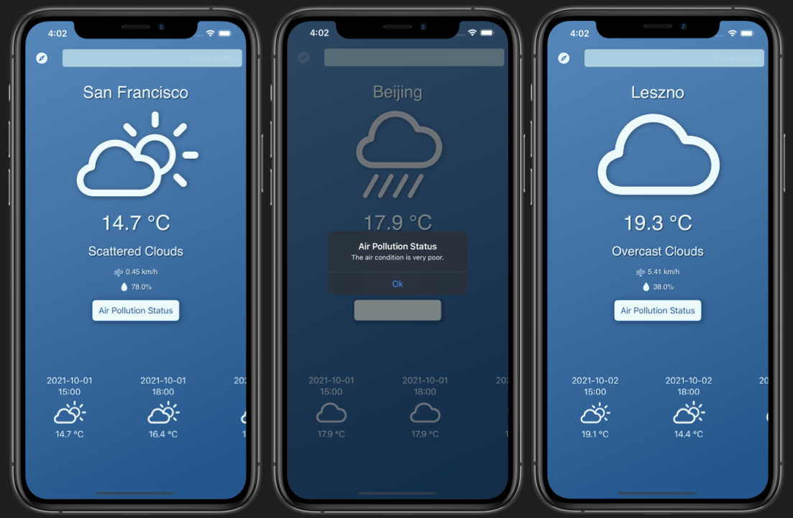

# Simple Weather

This is my attempt of creating basic weather app. I've done this using UIKit and OpenWeatherMapAPIs. I also implemented some basic Core Location, to get the device's current location and display the weather data for it. As you can see on the screenshots I wanted to display some basic information about current weather in particular location and forecast for the next 5 days (in 3h intervals). For the weather forecast section I used UICollectionView with custom cell made without Xib file (100% programatically). I also added button to get the information about current air quality status, which is displayed as an UIAlert.
 
 
 

### Assumptions:
1. Make my own UI Design in Sketch.
2. Make custom UICollectionView cell.
3. No 3rd party libraries.
4. Use OpenWeatherMapAPI (free tier).
 

### How to install
1. You will have to get your own Nomics API key and change one method inside NetworkManager.swift file (it is commented, to make it easier).
2. Clone this repo to Xcode.
3. Choose the Simulator.
4. Hit Run button.
 
 
 

### Screenshots

 
 
 
